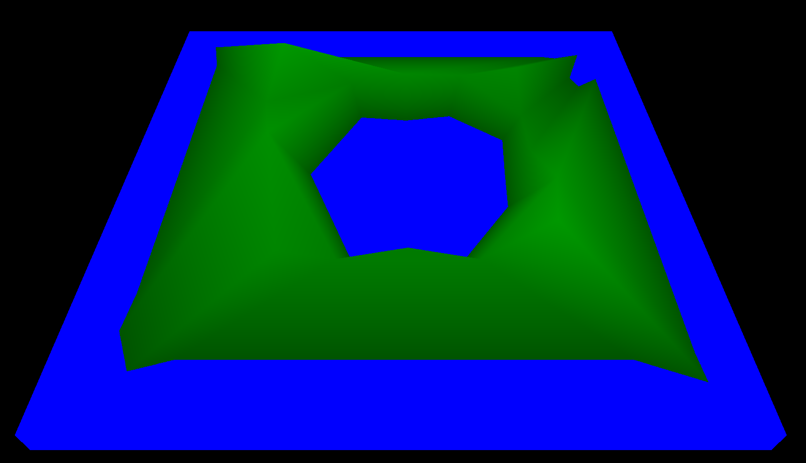

# mod1

## About the project

This project is from the 42 school curriculum, and was completed in a
72-hour timeframe over the course of a weekend. Due to the limited time
frame, the project could not be fully completed, and represents the
progress I was able to make in the given time.



The aim of this project was to render a 3-dimensional surface, and
simulate the effect of water being introduced to the environment. Full
instructions for the project can be seen [here](Mod1_Instructions.pdf).

### Built With

* [Rust](https://www.rust-lang.org/)
* [Glium](https://github.com/glium/glium)
* [Image](https://github.com/image-rs/image)

## Getting Started

### Prerequisites

This project requires Rust to compile and run. Rust can be installed by
following the official Rust installation instructions
[here](https://www.rust-lang.org/tools/install).

### Installation

To build the project and all associated binaries, run:
```
cargo build
```
to build the debug target, or `cargo build --release` to build the
release target with optimizations.

Multiple binaries exist within the project, all of which can be found
within `target/debug` or `target/release` depending on the build profile
used.

These binaries mark some of the progress of the project.

* surface1 - Displays a single square in 3D space, with rotation and
  movement of the camera possible with arrow keys.
* surface2 - Reads coordinates from a file, and uses these to produce
  the flat surface. Perspective is still absent.
* surface3 - Elevation is taken into account, and a color gradient is
  present on the surface dependent on the elevation of the coordinates.
* mod1 - The """final""" product. Code has been exported into
  `src/lib.rs` instead of all being present in `src/main.rs`.
  Camera positioning improved, error handling improved, and simplistic
  water effect added (water level can be raised and lowered over the
  surface).

## Usage

### Run Program

To run any of the binaries after building:
```
cargo run --bin <binary-name> <path-to-mod1-file>
```

Or
```
cargo run --release --bin <binary-name> <path-to-mod1-file>
```
to run the release build.

### Map files

A `mod1` map file must be present for `mod1` to run. A range of demo map
files are present in the `src/map/` directory.

A valid map file contains a list of coordinates on separate lines, with
3 values for each coordinate (an x, y and z value). Values must be
separated by commas and enclosed within parentheses (`()`).

An example valid map file is as follows:
```
(0, 0, 80)
(50, -10, 50)
(100, 0, 50)
(150, -10, 50)
(190, -10, 60)
(-10, 50, 70)
(0, 100, 50)
(0, 150, 45)
(0, 200, 60)
(50, 195, 55)
(100, 190, 60)
(150, 190, 50)
(210, 100, 70)
(220, 150, 60)
(210, 210, 80)
(100, 100, -110)
```

### Controls

* `←` - pan right (Yes, in current build left is right)
* `→` - pan left
* `↑` - pan forward
* `↓` - pan backwards
* `p` - increase camera elevation
* `o` - decrease camera elevation
* `d` - turn camera right
* `a` - turn camera left
* `w` - turn camera forwards
* `s` - turn camera backwards

* `j` - decrease water level
* `k` - increase water level


## Author

- Ryan Lucas (ryanl585codam@gmail.com)
